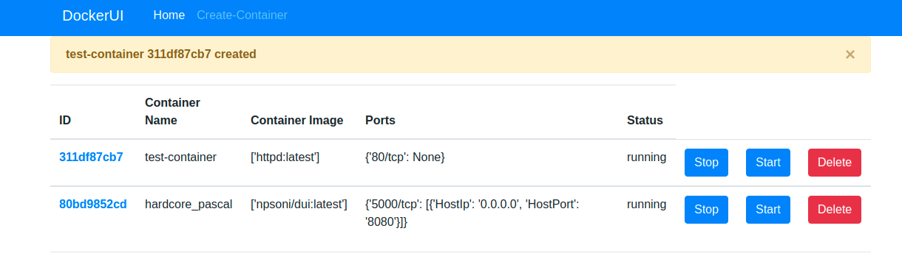

# DUI - Docker UI
A simple yet helpful web front-end for docker newbies to help them manage their containers and images.

## How to use?
You simlpy need to pull the docker image and run the app as a container. Execute the following command

        docker run -itd -v /var/run/docker.sock:/var/run/docker.sock -p 8080:5000 npsoni/dui:latest

That's it. Now you can visit http://localhost:8080 in your browser and you'll see the user interface.

## Screenshot

### Notes
* Its only tested on Linux and Mac at the moment.
* YOu can change the port "8080" to the port of your choice while executing the command